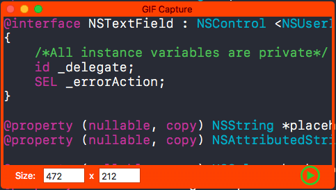
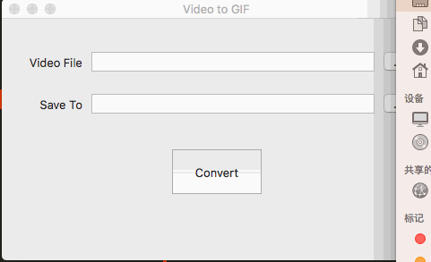

# GIFCapture

一款macOS端屏幕录制并转成GIF的小工具，同时提供将视频转成GIF的功能。

- 主界面

- 视频转GIF页面

- 视频源拖拽

## Requirements

- Xcode 8.0+
- macOS10.10+

## TODO

- `XPGIFGenerator`提供视频转GIF的功能，但是由于对这方面不熟悉，研究不够透彻，导致转换出来的GIF动图有问题，生成的GIF文件不仅很大，流畅度也不够。
- 能够像QQ截屏那样，通过拖拽决定录屏区域，并且可以录屏完整的屏幕(即包含菜单栏和Dock栏)

## License

基于MIT License进行开源，详细内容请参阅`LICENSE`文件。